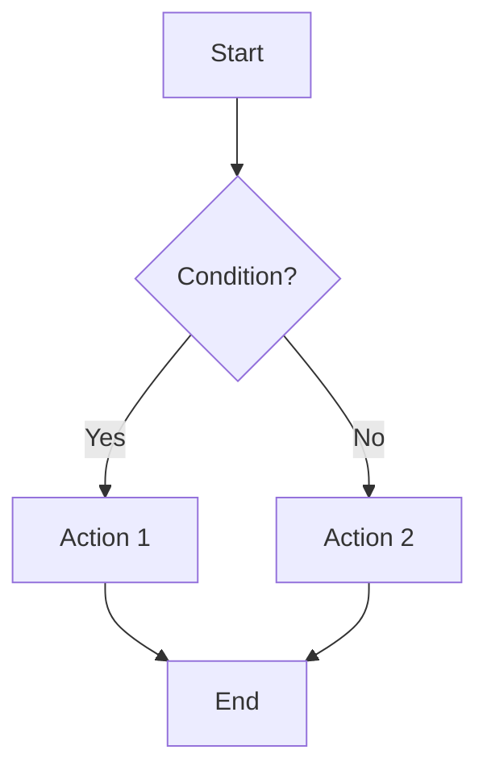

# Pre-Analysis Detailed Guide

Reference guide for Pre-Analysis Requirements in CLAUDE.md. Consulted on-demand for complex analysis tasks.

## 1. Mermaid Diagram First

**Purpose:** Visualize problem/solution before implementation.

**Example - Flowchart:**


**When to use:** Before analyzing bugs, proposing solutions, refactoring, or implementing features.

---

## 2. Code Reading Checklist

**Core implementation:**
- Complete function/method body (not just signature)
- Class fields, constructors, methods
- Variable declarations and initialization

**Call chain:**
- Upstream: Who calls this code?
- Downstream: What does this code call?
- Data flow: Controller → Service → Repository → Database

**Configuration files:**
- Application: `application.yml`, `application.properties`
- Build: `pom.xml`, `build.gradle`
- Environment: `.env` files

**Test code:**
- Unit tests for specific functions
- Integration tests for workflows
- Test data and mocks

**Example - Finding a bug:**
```java
// UserService.java:45
public boolean validateUser(String username) {
    if (username != null) {  // ⚠️ Bug: doesn't check empty string
        return true;
    }
    return false;
}

// LoginController.java:23 (caller)
if (userService.validateUser(username)) {
    // Empty string passes validation
}
```

---

## 3. Dependency JAR Analysis

**When needed:** Spring internals, third-party library behavior, dependency conflicts, version upgrades.

**Step 1 - Identify dependency:**
```java
import org.springframework.transaction.annotation.Transactional;
// From: org.springframework:spring-tx:5.3.20 (check pom.xml)
```

**Step 2 - Decompile JAR:**
```bash
jd-cli spring-tx-5.3.20.jar -od output/
find output/ -name "Transactional.java"
```

**Step 3 - Record evidence:**
```
JAR: org.springframework:spring-tx:5.3.20
Location: org.springframework.aop.framework.JdkDynamicAopProxy:210
Code: Proxy only intercepts public methods
```

**Real example - Why @Transactional fails on private methods:**

Business code: `UserService.java:23`
```java
@Transactional
private void updateUser(User user) {  // ⚠️ Private
    repository.save(user);
}
```

Spring AOP (decompiled): `JdkDynamicAopProxy:210`
```java
if (!Modifier.isPublic(method.getModifiers())) {
    return method.invoke(target, args);  // No transaction
}
```

**Conclusion:** Spring AOP proxies only intercept public methods.

---

## 4. No Speculation

**Forbidden words:** "possibly", "maybe", "probably", "should be", "might be", "seems like"

**Wrong:**
```
The issue is possibly caused by a null pointer in UserService.
```

**Correct:**
```
The issue is caused by NPE in UserService.validateUser():45

Evidence: src/main/java/com/example/UserService.java:45
    if (username.length() > 0) {  // NPE when username is null
```

---

## 5. Evidence Chain Completeness

**Required components:**
1. Code location: `file_path:line_number`
2. Key code snippet
3. Dependency evidence (if applicable): `groupId:artifactId:version`
4. Test verification (if applicable)

**Example - User login fails with empty username:**

**1. Validation logic:** `src/main/java/com/example/UserService.java:45`
```java
public boolean validateUser(String username) {
    if (username != null) {  // Only checks null, not empty
        return true;
    }
    return false;
}
```

**2. Caller:** `src/main/java/com/example/LoginController.java:23`
```java
if (userService.validateUser(username)) {
    return authenticate(username);  // Empty string proceeds
}
```

**3. Root cause:** Validation only checks `null`, not empty string.

---

## 6. Hypothesis Labeling

**Format:**
```
[Hypothesis] Brief statement

Missing evidence:
- What hasn't been checked
- What data is unavailable

Verification steps:
1. Specific action
2. Specific action
```

**After verification:**
```
[Confirmed] Statement with full evidence

Evidence:
1. Config: application.yml:15 — spring.datasource.hikari.maximum-pool-size=10
2. Logs: application.log:1523 — Connection timeout after 30000ms
3. Metrics: 10 active connections (pool maxed out)

Root cause: Pool size (10) insufficient for load (50+ users)
```
